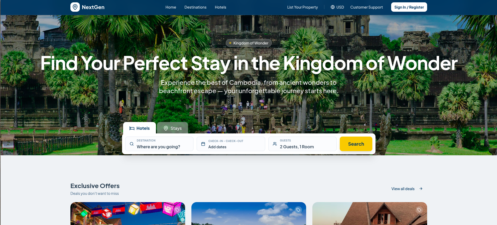
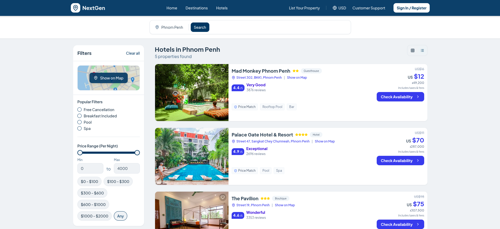
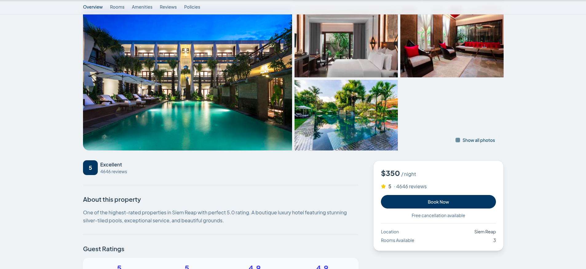
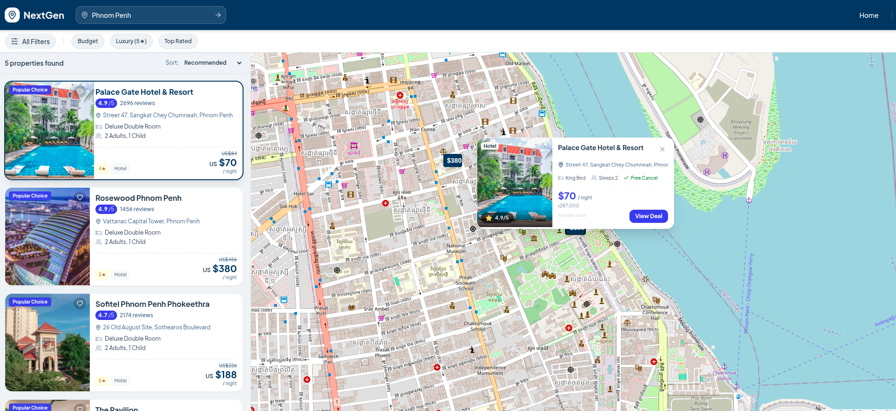

# NextGen Travel 🇰🇭


A high-fidelity, front-end prototype for a modern travel marketplace tailored to the Cambodian tourism sector. This project demonstrates a complete user journey—from destination discovery to checkout—alongside a preview of property owner tools.

**🚀 Live Demo:** [https://next-gen-rouge.vercel.app/](https://next-gen-rouge.vercel.app/)



## 📖 About The Project

NextGen Travel allows users to explore Cambodia's rich landscapes through a sleek, mobile-first interface. It serves as a design implementation reference for building complex booking platforms without the overhead of a backend.

**Key Objectives:**
*   **UX Excellence:** Providing a frictionless booking experience with immediate visual feedback.
*   **Local Focus:** Highlighting Cambodian destinations with immersive storytelling components.
*   **Dual-Persona:** Showcasing flows for both **Travelers** (booking) and **Hosts** (dashboard/management).

## ✨ Key Features

### 🌏 For Travelers
*   **Smart Discovery:** Curated destination guides and "Featured Offers" with immersive hero imagery.
*   **Advanced Search:** Real-time filtering by price, amenities, rating, and property type.
*   **Interactive Maps:** Integrated Leaflet maps to view hotel locations and prices dynamically.
*   **Seamless Checkout:** A multi-step booking mock-up including guest details and payment UI.
*   **State Management:** Favorites list, booking history, and toast notifications (Sonner) for user actions.

### 💼 For Hosts & Owners
*   **Property Dashboard:** Analytics preview, upcoming bookings, and revenue visualization.
*   **Listing Creation:** A step-by-step flow for adding new properties (UI only).
*   **Host Mode:** Dedicated layouts for managing inventory and guest communication.

## 🛠 Tech Stack

| Category | Technologies |
| :--- | :--- |
| **Core** | React 18, TypeScript, Vite |
| **Styling** | Tailwind CSS, clsx, tailwind-merge |
| **Components** | shadcn/ui (Radix Primitives), Lucide React (Icons) |
| **State & Data** | React Query (TanStack), React Router DOM |
| **Mapping** | React Leaflet, Leaflet CSS |
| **Forms** | React Hook Form, Zod (Validation) |
| **Deployment** | Vercel |

## 📸 Screenshots

| Search & Filters | Hotel Details |
| :---: | :---: |
|  |  |

| Map Search | Destination |
| :---: | :---: |
|  |  |

## 🚀 Getting Started

Follow these steps to run the project locally.

### Prerequisites
*   Node.js (v18 or higher)
*   npm or yarn

### Installation

1.  **Clone the repository**
    ```bash
    git clone https://github.com/your-username/next-gen-travel.git
    cd next-gen-travel
    ```

2.  **Install dependencies**
    ```bash
    npm install
    # or
    yarn install
    ```

3.  **Start the development server**
    ```bash
    npm run dev
    ```

4.  **Open in browser**
    Navigate to `http://localhost:5173` to view the app.

## 📂 Project Structure

```text
src/
├── components/       # Shared UI components (Buttons, Cards, Modals)
│   ├── ui/           # shadcn/ui primitive components
│   └── ...
├── data/             # Mock data (Hotels, Offers, User profiles)
├── hooks/            # Custom React hooks (useSearch, useBooking)
├── lib/              # Utilities (CN helpers, formatters)
├── pages/            # Page-level components (Routing targets)
│   ├── public/       # Landing, Search, Details
│   └── owner/        # Dashboard, Add Property
└── types/            # TypeScript interfaces
```

## ⚠️ Notes & Limitations

*   **Mock Data:** All data comes from `src/data/hotels.ts`. Changes usually reset on refresh unless persisted to local storage (feature pending).
*   **Backend:** There is no real API. Authentication, payment processing, and email confirmations are purely visual mocks.
*   **Maps:** Map tiles use OpenStreetMap (free). For high-traffic production, a paid tile provider (Mapbox/Google) would be required.

## 📄 License

Distributed under the MIT License. See `LICENSE` for more information.